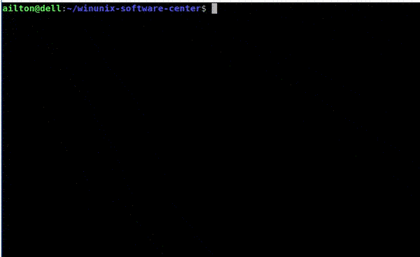

# WinuniX Software Center

> Uma central de software para Ubuntu's Customizados.

## Scaffolding

```
winunix-software-center/
├── main.py                 <-- Entrypoint do projeto, use para abrir a central
├── modules                 <-- Todos os Apps a serem pos instalados ficam aqui
│   ├── App1                <-- Todo App tem sua propria pasta nomeada sem espaços
│   │   ├── install         <-- Todo App deve ter um entrypoint de instalação
│   │   └── manifest.json   <-- Todo App deve conter esse arquivo
│   ├── App2
│   │   ├── install
│   │   └── manifest.json
│   └── AppN
│       ├── install
│       └── manifest.json
└── profiles                <-- Aqui ficam os perfis de Instalação
    ├── Administrativo.csv  <-- Cada arquivo csv é um perfil
    └── Laboratorio.csv
```

## Da pasta modules

Todo App ser deve ficar nessa pasta com um arquivo `install` com permissão de leitura e execução.

O arquivo `manifest.json` descreve como será apresentado na janela da central. Deve conter um atributo *name* e *description* conforme o exemplo abaixo:

```
{
	"name": "App1",
	"description": "Descricao do App 1"
}
```
> Observação: Nessa primeira versão só é permitida uso de caracteres ascii. Não use acentos em description.

## Da pasta profiles

Os perfis de instalação são arquivos *csv* contendo somente os nomes das pastas disponível em *modules* separados por quebra de linha. Veja um exemplo:

Administrativo.csv
```
App1
AppN
```

## Demo


